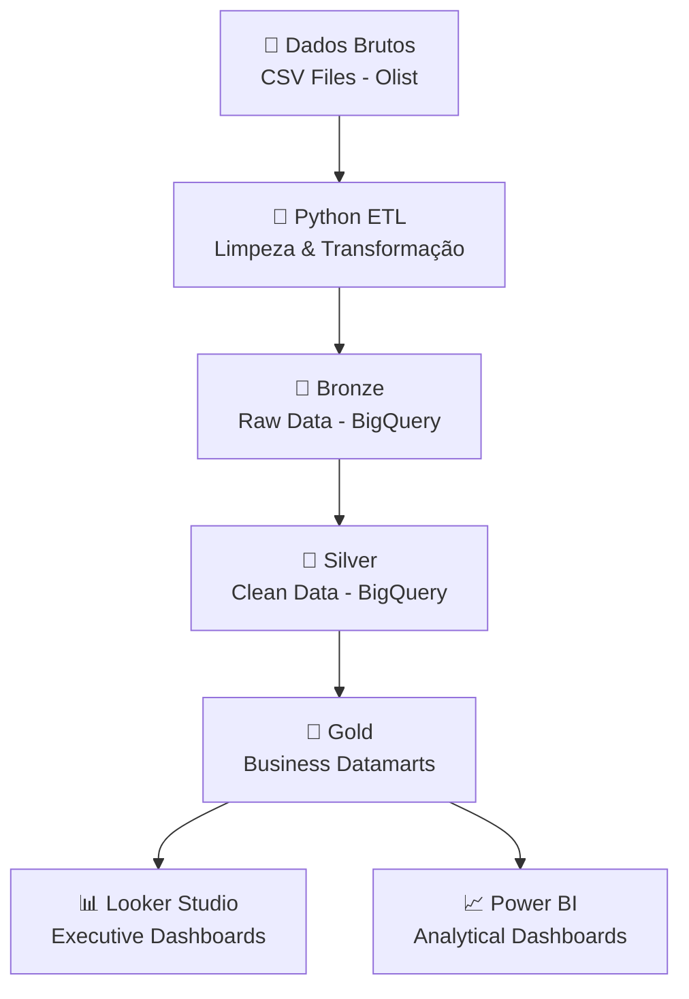

# 🛒 E-commerce Analytics Olist: Projeto BI End-to-End

# Galeria


#### Dados [Power query]


<div align="center">


*Solução completa de Business Intelligence para e-commerce, desde ETL automatizado até dashboards executivos, processando 100k+ transações da plataforma Olist (dados Kangl).*

[📊 Ver Dashboard Power Bi](#-https://app.powerbi.com/view?r=eyJrIjoiZTA4MTQ5YzQtOWYyZi00MGQ0LTkzZTctYjg4MGIyZjI5Y2Y0IiwidCI6IjJjMTQ4MTM4LTc1YWUtNDY0MC04N2I0LWZkNGMxZDIxMWMwOCJ9&pageName=a62acd9e029ce297b037) • [📊 Ver Dashboard Looker Studio](#-https://lookerstudio.google.com/u/1/reporting/72b37ad7-7c32-42a7-99b5-3baeee349e7f/page/p7wOF)

</div>

## 🎯 **Sobre o Projeto**

Este projeto implementa uma **solução de BI end-to-end** para análise de performance de e-commerce, utilizando dados reais da **plataforma Olist** (maior marketplace do Brasil). A solução abrange desde a ingestão de dados até dashboards executivos, fornecendo visão 360° do negócio.

### **Contexto de Negócio**
- 📈 **Objetivo**: Criar sistema de monitoramento contínuo para operação de e-commerce
- 🎯 **Foco**: Eficiência operacional, satisfação do cliente e performance de vendas
- 👥 **Usuários**: C-Level (visão estratégica) e analistas (exploração detalhada)
- 🔄 **Impacto**: Automatização de 100% dos relatórios manuais anteriores

## ⚙️ **Stack Tecnológica**

### **🔧 ETL & Processamento**
- **Python **: Pandas, google-cloud-bigquery
- **Google Cloud Platform**: BigQuery (Data Warehouse)
- **SQL**: Modelagem dimensional, views e métricas avançadas

### **📊 Visualização & BI**
- **Power BI**: Dashboards analíticos interativos + DAX
- **Looker Studio**: Painéis executivos automatizados
- **Google Cloud**: Integração nativa para atualizações em tempo real

## 🏗️ **Arquitetura do Projeto**

### **Pipeline de Dados (Medallion Architecture)**



### **🗄️ Modelo de Dados Dimensional**

| **Camada** | **Componente** | **Descrição** |
|------------|----------------|---------------|
| **Bronze** | Raw Tables | 9 tabelas originais do dataset Olist |
| **Silver** | Clean Tables | Dados tratados, normalizados e validados |
| **Gold** | **`olist_main`** | **View principal** com todas as métricas de negócio |

## 💡 **Principais Insights**

### 🏆 **Descobertas de Alto Impacto**

| 🔍 **Insight** | 📊 **Métrica** | 🎯 **Ação Estratégica** |
|----------------|----------------|-------------------------|
| **Correlação Satisfação-Entrega** |  | Otimizar logística como prioridade #1 |
| **Concentração Geográfica** | Sudeste: **60% do faturamento** | Expansão focada em outras regiões |
| **Regra 80/20** | **4 estados** = 80% da receita | Estratégia de key accounts por região |
| **Sazonalidade Logística** | Q1/Q4: **+23% tempo entrega** | Planejamento de capacidade sazonal |
| **Estagnação 2018** | Crescimento **zero desde Mar/2018** | Revisão de estratégia de aquisição |

### 📈 **KPIs Principais Monitorados**

- **📦 Ticket Médio**: R$ 137.79
- **🚚 Prazo Entrega**: 8.75 dias (média)
- **⭐ Satisfação Estimado**: 4.05 pontos (1 a 5)
- **💰 Faturamento**: R$ 13.45M 

## 🔄 **Fluxo de Trabalho (Workflow)**


### **1️⃣ Extração & Tratamento (Python)**
[Acesse Aqui o codigo aqui](https://github.com/Thiago-Folgado/eccomerce_olist/blob/main/scripts/etl.py)

### **2️⃣ Modelagem e querys (SQL)**
[Acesse Aqui o codigo aqui](https://github.com/Thiago-Folgado/eccomerce_olist/blob/main/docs/query_main_olist.txt)

### **3️⃣ Dashboards Inteligentes**
- **Looker Studio**: Atualização automática via BigQuery
- **Power BI**: Atualização automática via BigQuery
- **Métricas em Tempo Real**

### **🧮 Métricas Calculadas (DAX)**
```Exemplos
Clientes = DISTINCTCOUNT(olist_main[customer_id])
Faturamento = SUM(olist_main[valor])
Itens = COUNT(olist_main[order_id])
Media de vendas = AVERAGEX(olist_main,DISTINCTCOUNT(olist_main[order_id]))
```

## 📊 **Dashboards em Produção**

### 🎯 **Executive Dashboard (Looker Studio)**
**Público**: C-Level, Diretores  
**Frequência**: Visualização diária, atualização automática

**Métricas Principais:**
- 💰 **Revenue Overview**: Faturamento, crescimento, tendências
- 📦 **Operational KPIs**: Ticket médio, volume de pedidos
- 🎭 **Customer Satisfaction**: Satisfação, distribuição de avaliações
- 🚚 **Logistics Performance**: SLA de entrega
- 🗺️ **Geographic Analysis**: Performance por região/estado

### 📈 **Analytical Dashboard (Power BI)**
**Público**: Analistas, Gerentes operacionais  
**Frequência**: Análise ad-hoc, drill-downs dinâmicos

**Funcionalidades Avançadas:**
- 🔍 **Drill-down Hierárquico**: Região → Estado → Cidade
- 🎯 **Segmentação Dinâmica**: Por categoria, faixa de preço, perfil cliente
- ⚡ **Filtros Interativos**: Filtros a demanda

## 🎯 **Casos de Uso Reais**

### **🏢 Para Executivos**
- **Monitoramento de KPIs** em tempo real
- **Identificação de tendências** de mercado
- **Benchmark regional** de performance

### **📊 Para Analistas**
- **Segmentação** de clientes
- **Análise de produtos** por categoria/região
- **Otimização de logística** baseada em dados

### **💼 Para Gestão Operacional**
- **Identificação de gargalos** logísticos
- **Análise de satisfação** por fornecedor
- **Planejamento de demanda** sazonal

## 📁 **Estrutura do Repositório**

```
ecommerce-olist-bi/
├── 📁 docs/
│   ├── Diagram.png                      # Print Diagrama
│   └── query_main.txt                   # Query SQL utilizada para criar view principal
├── 🐍 scripts/
│   ├── etl.py                           # Pipeline Python
│   ├── etl.ipymb                        # Pipeline Python (notebook)
└── 📦 requirements.txt                  # Dependências Python
```


## 📈 **Resultados & Impacto**

### **🎯 Métricas de Sucesso**
- ⚡ **Redução** no tempo de geração de relatórios
- 📊 **100% automação** de KPIs executivos
- 🔍 **Identificação de insights** acionáveis de alto impacto
- 📱 **Acesso mobile** para executives via Looker Studio
- 🚨 **Sistema de alertas** para métricas críticas (Não concluido)

### **💼 Aplicabilidade Empresarial**
- **Escalabilidade**: Arquitetura suporta 10x mais dados
- **Manutenibilidade**: Código modular e documentado
- **Custo-efetivo**: Uso otimizado de recursos cloud
- **Self-service**: Analistas podem criar novas views

## 🔗 **Links dos Projetos**

### **📊 Dashboards Live**
- 🎯 **[Executive Dashboard - Looker Studio](https://lookerstudio.google.com/u/1/reporting/72b37ad7-7c32-42a7-99b5-3baeee349e7f/page/p7wOF)**: Visão estratégica para C-Level
- 📈 **[Analytical Dashboard - Power BI](https://app.powerbi.com/view?r=eyJrIjoiZTA4MTQ5YzQtOWYyZi00MGQ0LTkzZTctYjg4MGIyZjI5Y2Y0IiwidCI6IjJjMTQ4MTM4LTc1YWUtNDY0MC04N2I0LWZkNGMxZDIxMWMwOCJ9&pageName=a62acd9e029ce297b037)**: Exploração interativa para analistas

### **💻 Código & Documentação**
- 🐙 **[GitHub Repository](https://github.com/Thiago-Folgado/eccomerce_olist)**: Código completo ETL + SQL

## 👤 **Sobre o Autor**

**[Thiago Folgado]**  
*Data Analytics | Business Intelligence*

- 💼 2 anos de experiência em BI e Reporting
- 🎯 Especialização em análise exploratória e visualização de dados
- 📊 Projetos com Python, Pandas, e ferramentas de BI

- **Projetos Relacionados:**
- 📚 [Análise ENEM](https://github.com/Thiago-Folgado/enem/blob/main/README.md)

**Contato**: [LinkedIn](https://www.linkedin.com/in/thiagohenriquef/) | [Portfólio](https://thiagofolgado.framer.website/)

---

## 📄 **Licença & Dados**

Este projeto utiliza dados públicos da **Olist** disponibilizados no Kaggle.  
Dashboards são para fins educacionais e de portfólio.

---

<div align="center">

**⭐ Se este projeto demonstrou valor, considere dar uma estrela!**

</div>
